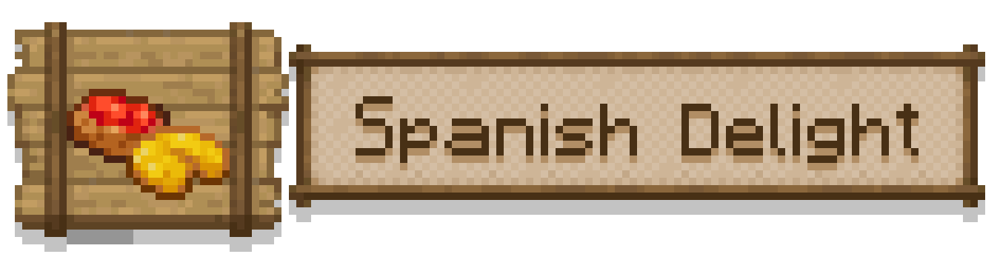

# Spanish Delight

<!------>

<strong>Spanish Delight</strong> is a mod that expands upon the cooking system from <strong>Farmer's Delight.</strong>

It introduces different types of spanish plates such as Gazpacho, Spanish Tortilla, Croquettes and more!  

Find new ingredients spawned in the world and cook delicious new meals!  

⚙️ <strong>Dependencies:</strong>

You will need <strong>Farmers Delight</strong> and Forge to run this mod, and optionally but highly recommended <strong>JEI</strong> !

🧾 <strong>More:</strong>

I'm planning to add more foods and also doing the Fabric version in the future. Also, if you want to see the mod done for another Minecraft version comment it!

📝 <strong>Credits:</strong>

Developed by DevJulen

Big thanks to vectorwing for creating Farmer's Delight <a href="https://www.curseforge.com/minecraft/mc-mods/farmers-delight" rel="nofollow">https://www.curseforge.com/minecraft/mc-mods/farmers-delight</a>

Big thanks to ArBeet for creating the assets! <a href="https://x.com/ArBeeeet">https://x.com/ArBeeeet</a>

🌐 <strong>Socials:</strong>

Twitter: <a href="https://x.com/DevJulen" rel="nofollow">https://x.com/DevJulen</a>

Instagram: <a href="https://www.instagram.com/devjulen/" rel="nofollow">https://www.instagram.com/devjulen</a>

Itch.io: <a href="https://devjulen.itch.io" rel="nofollow">https://devjulen.itch.io</a>

&nbsp;

